# Climate Data Exploratory Data Analysis 🌍📊

## Overview

This project performs **Exploratory Data Analysis (EDA)** on a climate dataset spanning **1900-2023**, analyzing the following key variables:

- 🌡️ **Global Temperature**
- 🏭 **CO2 Concentration**
- 🌊 **Sea Level Rise**
- ❄️ **Arctic Ice Area**

The goal is to explore trends, relationships, and patterns within these variables using **Python** (Pandas, Matplotlib, Seaborn). Through univariate, bivariate, and multivariate analysis, we examine how these climate indicators have changed over time and their interactions.

---

## 1. Data Preparation 🗂️

- ✔️ Loaded & cleaned dataset (`Climate_Change_Indicators.csv`).
- ✔️ Aggregated data by **year** to observe long-term trends.
- ✔️ Checked for missing or inconsistent values and ensured data integrity.
- ✔️ Computed annual averages for each climate variable to facilitate trend analysis.

---

## 2. Univariate Analysis 📈

### Summary:

- **Box & Violin Plots**: Showed distributions and variability for all four climate indicators.
- **Strip Plots**: Examined how each variable evolved by decade.
- **Time Series Plots**: Illustrated trends of all four variables across decades.

### Visualizations:

- 📌 **Box & Violin Plots**
  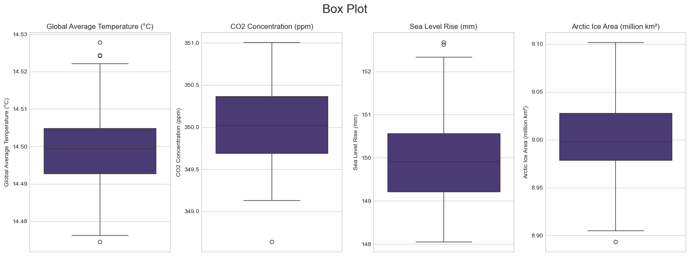
  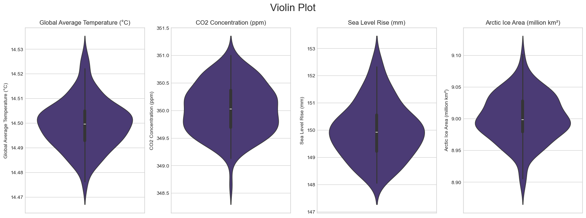
- 📌 **Strip Plots**
  
  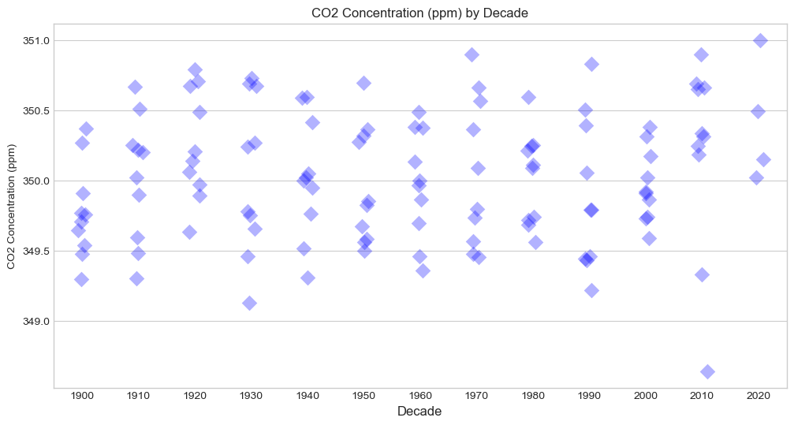
  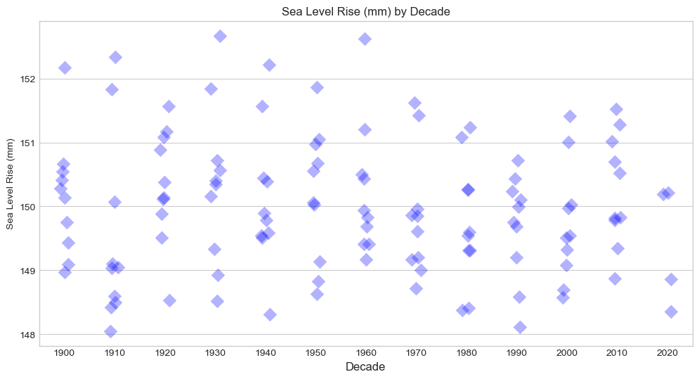
  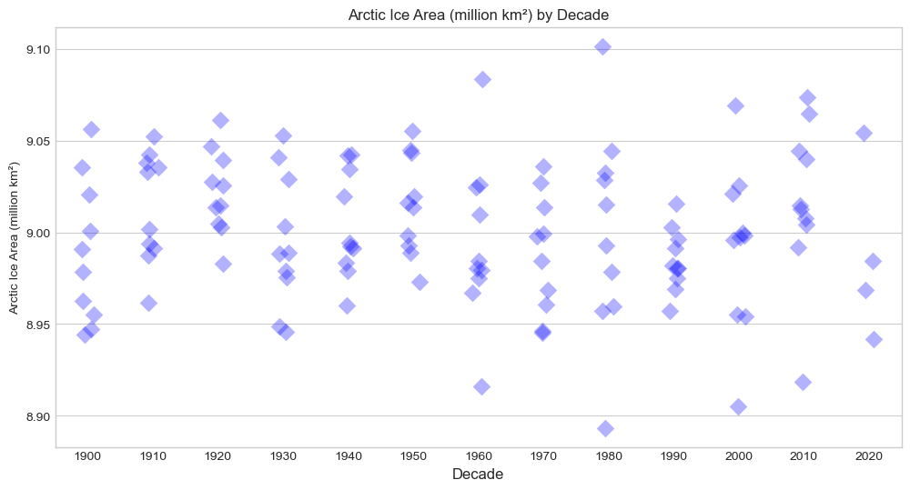
- 📌 **Time Series Plots**
  
  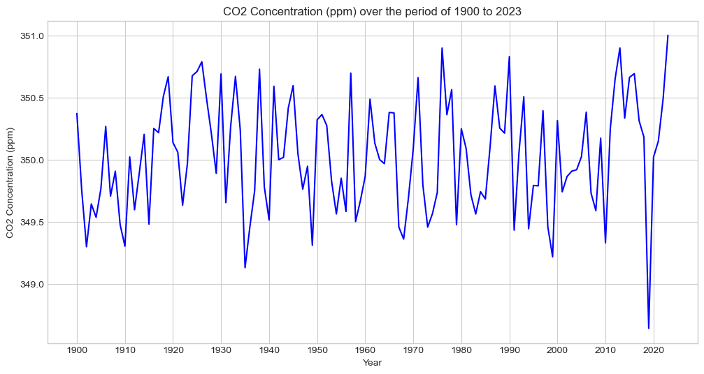
  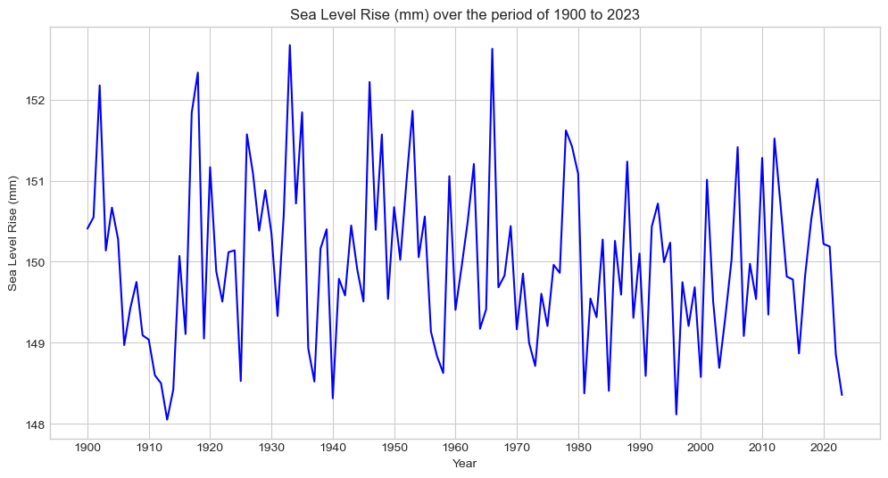
  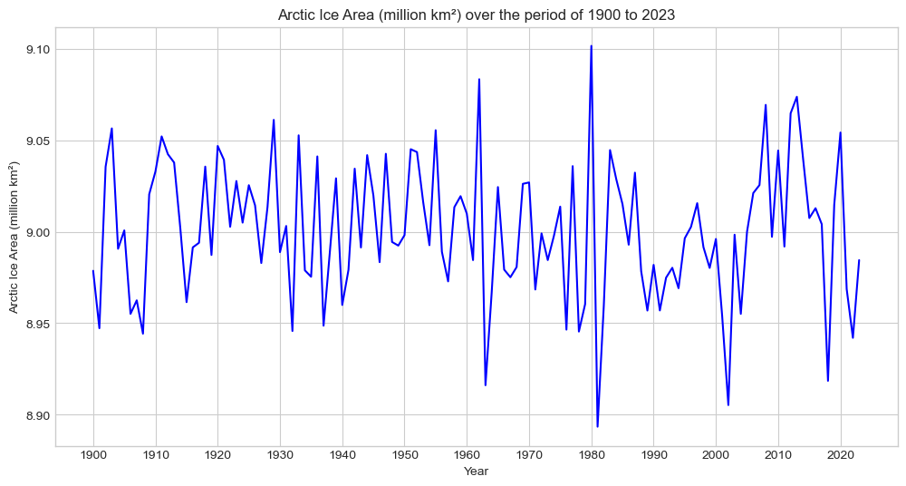

### Key Findings:

- **Temperature & CO2 levels** are relatively stable over the years but exhibit **minor fluctuations**.
- **Sea level rise** is gradually increasing over time.
- **Arctic ice area** is **declining** slightly, with some short-term fluctuations.
- **CO2 concentration** has steadily increased over time, and this is especially visible in the latter part of the dataset.

---

## 3. Bivariate Analysis 🔗

### Summary:

- **Correlation Heatmap**: Checked relationships among all variables.
- **Scatter Plots**: Explored direct relationships between variables (e.g., Temperature vs. CO2, Sea Level vs. Arctic Ice).
- **Line Plot (1990-2023)**: Showed trends in Temperature & Sea Level over time.

### Visualizations:

- 📌 **Correlation Heatmap**
  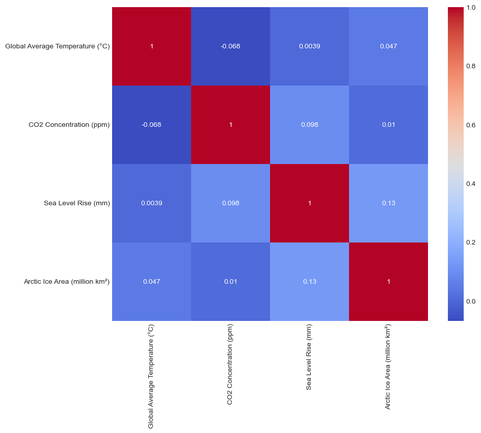
- 📌 **Scatter Plots**
  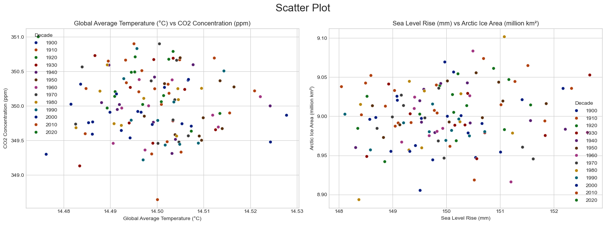
- 📌 **Line Plot (1990-2023)**
  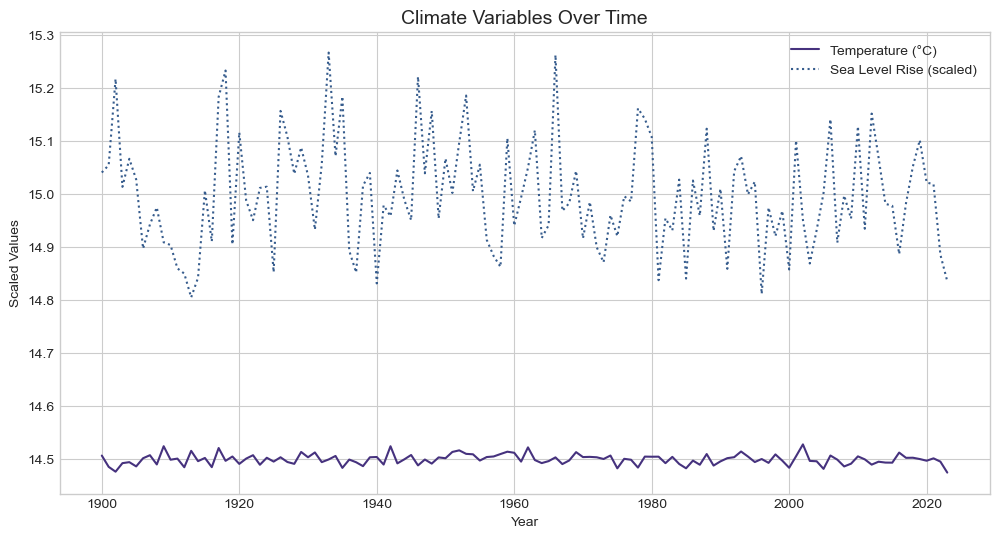

### Key Findings:

- **Weak correlation (-0.07)** between **temperature & CO2** in this dataset, which may be due to short-term variations rather than a clear long-term trend.
- **Sea level rise** and **Arctic Ice Area** show a **slight inverse relationship** (-0.13 correlation), indicating that as sea levels rise, the Arctic ice area is gradually declining.
- Both **Temperature** and **Sea Level** have risen from 1990-2023, confirming long-term climate change trends.

---

## 4. Multivariate Analysis 📊

### Summary:

- **Pair Plot**: Explored relationships among all four variables.
- **3D Plot**: Examined interactions between **Temperature, CO2, Arctic Ice, and Sea Level**.

### Visualizations:

- 📌 **Pair Plot**
  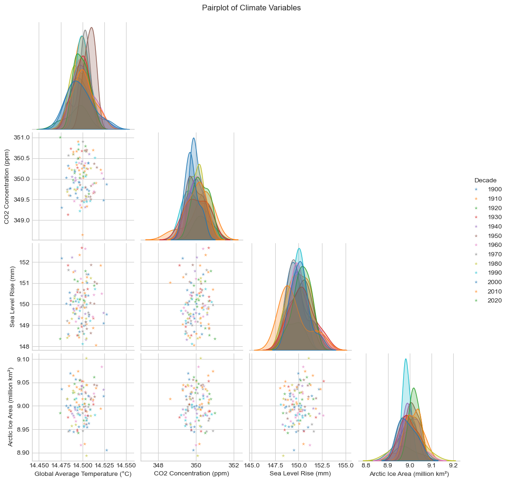
- 📌 **3D Plot**
  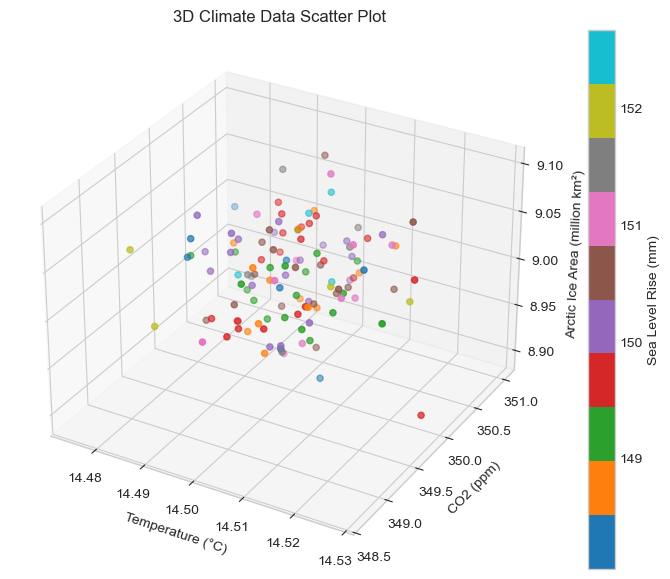

### Key Findings:

- **No strong patterns** among all four variables, likely due to **small year-to-year variations**.
- **Temperature, CO2, and Arctic Ice** show complex interactions, suggesting that multiple factors influence these climate variables. Further analysis over longer timescales or with additional datasets could reveal clearer trends.

---

## 5. Findings & Conclusion 🏁

### Key Takeaways:

- ✔️ **CO2 concentration & temperature** show weak correlation in this dataset, likely due to short-term variations. Long-term studies confirm that CO2 drives warming.
- ✔️ **Sea levels are rising steadily**, with higher values becoming more common in recent decades.
- ✔️ **Arctic Ice Area** is gradually decreasing, which aligns with expected climate change effects.
- ✔️ The relationships between these variables are complex, indicating that **climate change is influenced by multiple interdependent factors**, such as ocean currents, greenhouse gases, and deforestation.

### Final Thoughts:

While this dataset provides valuable insights into climate trends, it has small year-to-year variations. Stronger correlations might appear if the analysis includes data over **longer timescales** or with more diverse datasets (e.g., greenhouse gases, ocean cycles, and deforestation). This EDA highlights significant **climate trends**, such as the steady **rise in sea levels** and the gradual **decline in Arctic ice**. However, **multivariate relationships** are complex, and more detailed research is needed to fully understand how these variables interact over time.

---

## 6. Submission & Repository Details 📂

### 📁 Files included:

- `climate_eda.ipynb` (Full analysis & code)
- `Visualizations/` (All visualizations used in this README)
- `Climate_Change_Indicators.csv` (Dataset)

### 🚀 Built with:

- Python, Pandas, NumPy, Matplotlib, Seaborn

---

## Next Steps 🚀

- 🔹 Add more climate variables (e.g., methane, ocean currents) for deeper insights.
- 🔹 Build an interactive dashboard (e.g., Streamlit, Dash).
- 🔹 Extend the dataset for longer historical analysis.
